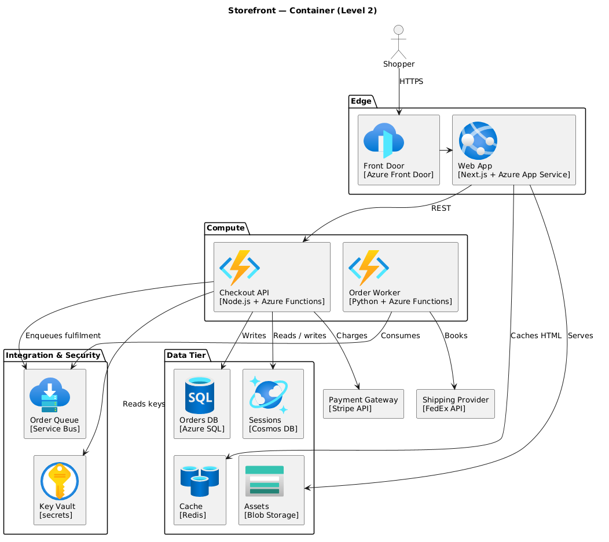

# archicon

Architecture diagrams as code. A 7-vendor icon library + an AI-agent skill that
turns plain-language prompts into rendered PlantUML diagrams. Output works on
Confluence, GitHub, and `www.plantuml.com/plantuml/uml/` — no CDN, no auth, no hosted assets.

📦 `@hanv89/arch-skill` · stable since v1.0.0 · 7 vendors / ~2100 icons · MIT (code) / upstream licences (icons)

## Quick start (60 seconds)

**1.** Install the skill into your AI agent:

```bash
npx skills add hanv89/archicon                       # ecosystem CLI, 70+ agents
npx @hanv89/arch-skill install --agent=claude-code   # this repo's CLI — or codex | cursor | all
```

The ecosystem CLI copies or symlinks the whole skill directory and does not
verify checksums. This repo's CLI checks every file's `sha256` against the
install manifest before writing it.

> **Choose install scope** *(optional, default = `user`)*: add `--scope=project` to install into `<cwd>/.claude/skills/` for team-shared diagrams checked in via git; default `--scope=user` writes to `~/.claude/skills/` for personal use across all repos. Cursor is project-only by architecture (User Rules in Cursor are settings-only, not file-writable).

**2.** Ask your agent (copy-paste this prompt):

> Draw a Container diagram for a 3-tier web app on Azure: Front Door → App Service → Cosmos DB + Azure SQL + Cache for Redis, with Key Vault for secrets.

**3.** Paste the PlantUML output the agent emits into
[www.plantuml.com/plantuml/uml/](https://www.plantuml.com/plantuml/uml/) —
your diagram renders with real Azure icons in a few seconds.



*From [`skills/architecture-diagram/examples/17-ladder-container.puml`](skills/architecture-diagram/examples/17-ladder-container.puml)
— the canonical Container-level view of an e-commerce stack. Same shape your
agent will produce for the prompt above.*

## What you get

- **Icons — 7 vendors, ~2100 PNGs**: Azure 528 / Fabric 312 / Kubernetes 148 /
  FluentUI 75 / Devicon 149 / AWS 868 / GCP 19. Tag-pinned
  `raw.githubusercontent.com` URLs; no CDN, no auth. Per-vendor licence terms
  in [`NOTICE`](./NOTICE) + `dist/<Vendor>/USAGE-RULES.txt`.
- **Skill** (`skills/architecture-diagram/SKILL.md`): C4 diagram taxonomy (Context / Container /
  Component / System Landscape / Dynamic / Deployment), 7-field header
  convention, HLD / ADR / Detailed Technical Design document scaffolds,
  strict-vs-freestyle style modes, 5 layout-compaction rules, and a 6-question
  skip-if-clear selection workflow (document / audience / cloud / level / format /
  create-vs-edit; most prompts fire 0–4 questions). **20 worked examples**
  (`.puml` diagrams + `.mmd` Mermaid + 1 `.md` agent-dialogue transcript).
- **CLI** (`@hanv89/arch-skill`): one command installs the skill bundle into
  your agent's folder.
- **Supply-chain integrity**: per-file `sha256` in the install manifest; the
  CLI verifies each file before writing.
- **IaC → diagram (experimental)**: `scripts/iac_to_diagram.mjs` (Terraform
  `azurerm` → PlantUML).

> **AWS** ships verbatim per CC-BY-ND (no resize/recolor — a CI gate enforces
> byte-identity to upstream). **Google Cloud** ships at uniform 64×64 per
> Google's brand guidelines. Both **not affiliated with / endorsed by AWS or
> Google** — see [`NOTICE`](./NOTICE) + each `dist/<V>/USAGE-RULES.txt`.

## CLI

| Command | Purpose |
|---|---|
| `install --agent=<claude-code\|codex\|cursor\|all>` | Install the skill bundle into the agent's folder |
| `uninstall --agent=<…>` | Remove it |
| `update --agent=<…>` | Re-install the latest (idempotent) |
| `list` | Show installed adapters |
| `--version=X.Y.Z` | Pin a specific skill release |
| `--scope=user\|project` | Install scope (default `user` for claude-code + codex; `project` writes to `<cwd>/.claude/skills/...` for team-shared installs via git; cursor is project-only) |

Adapters supported: **Claude Code**, **Codex CLI**, **Cursor**.

## Chat-UI users (Claude.ai Projects / ChatGPT)

Download `chat-ui-bundle.zip` from the [latest release](https://github.com/hanv89/archicon/releases/latest)
and upload it as a Project / Custom GPT knowledge file. See
[`docs/chat-ui-distribution/`](docs/chat-ui-distribution/) for per-channel
setup recipes.

## IaC → diagram (experimental)

```bash
node scripts/iac_to_diagram.mjs path/to/main.tf > architecture.puml
```

Extracts `resource "azurerm_<type>" "<name>"` blocks, maps known types to
Azure icons via
[`scripts/fixtures/iac-azurerm-icon-map.tsv`](scripts/fixtures/iac-azurerm-icon-map.tsv),
and infers edges from Terraform references. Terraform `azurerm` only;
best-effort regex (no modules / `for_each` / heredocs); unknown types render
as text nodes + a coverage report on stderr. Pin icons with
`--ref icons-v1.0.0` for output stable against a released snapshot (default
`main` tracks latest).

## Contributing

Issues + PRs welcome — see [`CONTRIBUTING.md`](./CONTRIBUTING.md) (adding
icons, the leak-check pre-push hook via `make setup`).

## License

Code (CLI, scripts, workflows): [MIT](./LICENSE). Icons: under their
respective upstream licences — see [`NOTICE`](./NOTICE).
