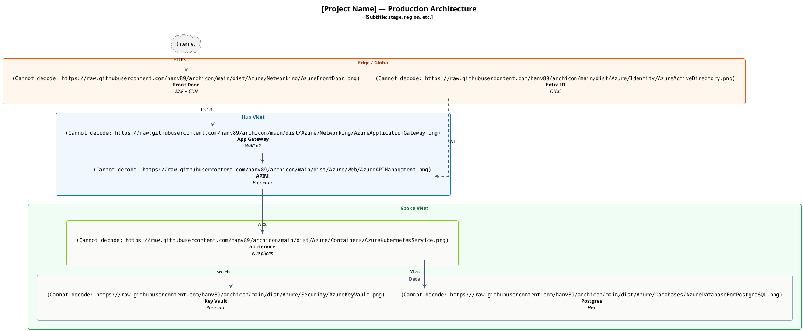

# Architecture Diagram Skill (PlantUML + Mermaid)

This skill describes how to draw architecture diagrams with PlantUML (primary) or Mermaid (secondary), using icons from the `hanv89/archicon` repository covering 7 vendors (Azure, Fabric, Kubernetes, FluentUI, Devicon, AWS, GCP). Icons are referenced by public `raw.githubusercontent.com` URL — no local assets, no CDN. PlantUML fetches each `` at render time.

## What this skill covers

The YAML `description:` field above is kept under the 1024-character Claude UI import limit, so it carries only the highest-signal triggers + vendor list. Beyond icon usage, the skill drives the following — each with its own section in this document:

- **C4 diagram taxonomy** (Context / Container / Component / System Landscape / Dynamic / Deployment) + complementary types (Sequence / Pipeline / Workflow). See [§ "Diagram taxonomy"](#diagram-taxonomy).
- **Document scaffolds** for **HLD** (High-Level Design), **ADR** (Nygard format), and **Detailed Technical Design** — section skeletons + recommended diagrams per scaffold. See [§ "Choosing diagrams by document type"](#choosing-diagrams-by-document-type).
- **`mode: strict | freestyle`** style modes — strict default applies the layout rules + 7-field header; freestyle = icon-lookup only. See [§ "Style modes"](#style-modes).
- **7-field header convention** for every `.puml` / `.mmd` (`title / type / level / mode / audience / question / adr`). See [§ "Header convention"](#header-convention).
- **Layout compaction** — five empirical rules (tight `ranksep`/`nodesep`; hidden-edge-as-alignment-hint; 2×N grids; every-node-in-a-cluster; cross-cluster row anchors). See [§ "Layout compaction"](#layout-compaction).
- **Selection workflow** — when the user request is vague, the agent asks 2 questions (which document? who's the reader?) before drawing. See [§ "Selection workflow"](#selection-workflow).
- **Anti-patterns** — 9 review-time pitfalls (mixing levels, drilling Component without a decision, HLD-for-small-change, …). See [§ "Anti-patterns"](#anti-patterns).
- **Confluence integration** via PlantUML apps (AppsFoundry, weweave, …). See [§ "Confluence integration (PlantUML apps)"](#confluence-integration-plantuml-apps).
- **Mermaid mode** — secondary output for GitHub-native rendering (icon-light) and CLI/browser render (icon-mode with vendor PNGs via ``). See [§ "Mermaid mode"](#mermaid-mode).
- **Experimental Terraform → PlantUML generator** — `scripts/iac_to_diagram.mjs` extracts `resource "azurerm_<type>"` blocks + maps to Azure icons. See repo `README.md`.

Natural-language requests in any of the areas above will activate the skill, even if the exact trigger phrase doesn't appear in `description:`.

## When to use

Use this skill for:
- Reference architecture documents (Confluence pages)
- Technical design documents (TDD)
- Pre-RFC architecture proposals
- Production runbook diagrams
- Multi-region deployment topologies

Do NOT use this skill for:
- UI mockups (use Figma / draw.io)
- Network packet flow diagrams (use Wireshark)
- Database ER diagrams (use dbdiagram.io or PlantUML's separate ER syntax)

## Microsoft icon use rules (read before authoring)

> **By referencing or redistributing Microsoft Azure architecture icons via this skill, you agree to the [Microsoft Azure Architecture Icons Terms of Use](https://learn.microsoft.com/en-us/azure/architecture/icons/) and the [Microsoft Trademark and Brand Guidelines](https://www.microsoft.com/en-us/legal/intellectualproperty/trademarks/usage/general). This skill does not transfer or sublicense Microsoft's trademarks; it propagates Microsoft's terms unchanged.**

The Microsoft icons referenced by this skill are Microsoft trademarks. Their use is governed by the Microsoft Azure Architecture Icons Terms of Use and the Microsoft Trademark and Brand Guidelines (linked above). The repository's `dist/Azure/USAGE-RULES.txt` and `NOTICE` files re-state these terms in human-readable form; this section binds them into the diagrams an AI agent emits.

### Verbatim Don'ts (from Microsoft)

- Don't crop, flip, or rotate icons.
- Don't distort or change icon shape in any way.
- Don't use Microsoft product icons to represent your product or service.

Use the icons only for architectural diagrams, training materials, or documentation. Always show the product name as a label adjacent to the icon (this is a Microsoft Do).

### Anti-example (do NOT emit) and corrected version

```plantuml
' WRONG — this rotates the Front Door icon, violating MS ToU.
rectangle "\nAzure Front Door" as fd
fd -[hidden]-> fake_anchor : "rotate=45 — never do this"
' (PlantUML doesn't have a rotate primitive on , but if it did, it would be off-limits.
'  The same rule applies to recoloring, mirroring (`flip`), or scaling the icon non-uniformly.)
```

```plantuml
' RIGHT — icon used as-published, with the product name labelled next to it.
rectangle "\nAzure Front Door" as fd
```

If a downstream PlantUML rendering pipeline applies a global transform that would crop / flip / rotate Microsoft icons, the agent must explicitly disable it for icon images, even if that means refusing to emit the diagram and asking the user to remove the offending pipeline step.

## Setup

> **Output modes**: this skill is PlantUML-first (vendor icons embedded via ``). For a GitHub-native, icon-light diagram, see § "Mermaid mode". To generate a starting diagram from a Terraform file, see the repo README § "IaC → diagram (experimental)". To revise a diagram the user already has, see § "Editing an existing diagram".

Every diagram should include 3 setup blocks. Use **literal URLs** in every `` reference (see § "Do not use `!define` macros for icon URLs" below).

```plantuml
@startuml DiagramName

' 1. Skinparam: layout, fonts, default colors
top to bottom direction
skinparam linetype ortho
skinparam ranksep 28
skinparam nodesep 22
skinparam shadowing false
skinparam roundcorner 10
skinparam defaultFontName "Inter, Arial, sans-serif"
skinparam defaultFontSize 13
skinparam defaultTextAlignment center
skinparam ArrowColor #475569
skinparam ArrowFontSize 11
hide stereotype

' 2. Icon container - transparent (icons float freely without a frame)
skinparam rectangle {
  BackgroundColor transparent
  BorderColor transparent
  FontColor #1F2937
}

' 3. Cluster styles - define stereotype for each group type
skinparam rectangle<<edge>> {
  BackgroundColor #FFF7ED
  BorderColor #EA580C
  FontColor #9A3412
}
skinparam rectangle<<vnet>> {
  BackgroundColor #F0F7FF
  BorderColor #0078D4
  FontColor #075985
}
' ... (see full palette in § Common patterns reference below)
```

## Icon URLs

Reference each icon with its full literal URL inside a `` token. The base URL pattern is:

```
https://raw.githubusercontent.com/hanv89/archicon/main/dist/Azure/<Category>/<ServiceName>.png
```

Example references:

```plantuml
' Azure core services (paste the full URL into ; do not abbreviate with macros — see below)


```

### Finding the right icon (use the INDEX)

Every icon ships with a flat markdown catalog you can grep. Each row carries the path, a human name, a description, and tags so you can look up the right `<Category>/<file>.png` without guessing.

- Azure: <https://raw.githubusercontent.com/hanv89/archicon/main/dist/Azure/INDEX.md>
- Fabric: <https://raw.githubusercontent.com/hanv89/archicon/main/dist/Fabric/INDEX.md>
- Kubernetes: <https://raw.githubusercontent.com/hanv89/archicon/main/dist/Kubernetes/INDEX.md>
- FluentUI: <https://raw.githubusercontent.com/hanv89/archicon/main/dist/FluentUI/INDEX.md>
- Devicon: <https://raw.githubusercontent.com/hanv89/archicon/main/dist/Devicon/INDEX.md>
<!-- AWS-SKILL-BEGIN -->
- AWS: <https://raw.githubusercontent.com/hanv89/archicon/main/dist/AWS/INDEX.md>
<!-- AWS-SKILL-END -->
- GCP: <https://raw.githubusercontent.com/hanv89/archicon/main/dist/GCP/INDEX.md>

When the user names a service, **fetch the relevant INDEX.md once at the start of a session, search it (case-insensitive substring or tag match across name + description + tags), and use the `path` column from the matching row** verbatim in your `` token.

The category-level directory listing is still useful for browsing: `https://github.com/hanv89/archicon/tree/main/dist/Azure`.

### Filename rule (non-negotiable)

> Every `` token MUST use a filename copied verbatim from the `path` column of the relevant `INDEX.md`. Guessing a filename from the product name is forbidden. Vendor canonical filenames routinely diverge from common product naming, and a mismatch returns HTTP 404 from `raw.githubusercontent.com` — PlantUML then renders a broken-image placeholder with no error message. The render looks "almost right" until a reviewer notices.

Worked counter-examples (real canonical filenames vs the names an agent would guess):

| Product name a user might say | Wrong (guessed) filename | Correct (canonical) filename |
|---|---|---|
| `Azure SQL Database` | `AzureSQLDatabase.png` | `AzureSqlDatabase.png` |
| `Microsoft Entra ID` | `MicrosoftEntraID.png` | `AzureActiveDirectory.png` |
| `Azure Cache for Redis` | `AzureCacheForRedis.png` | `AzureRedisCache.png` |
| `Microsoft Fabric Lakehouse` | `Lakehouse.png` | `lakehouse_40_item.png` |
| `Kubernetes Pod` | `Pod.png` | `resources/labeled/pod-128.png` |
| `Microsoft FluentUI Cloud` | `Cloud.png` | `cloud_48_color.png` |
| `Python (Devicon)` | `python.png` | `python-original_48.png` |

The `INDEX.md` `path` column is authoritative; PNG-on-disk filenames are authoritative; product names are not. If an agent has not consulted the INDEX.md for the source it's drawing from, it has not yet earned the right to emit an `` token for that vendor.

#### Anti-example (do NOT emit) and corrected version

```plantuml
' WRONG — guessed filename `AzureSQLDatabase.png` does not exist on disk;
'         raw.githubusercontent.com returns 404; PlantUML renders a broken-image placeholder.
rectangle "\nAzure SQL Database" as sql
```

```plantuml
' RIGHT — canonical filename `AzureSqlDatabase.png` from dist/Azure/INDEX.md row.
rectangle "\nAzure SQL Database" as sql
```

This exact typo broke `examples/07-azure-aks-mixed.puml` in an early shipping cycle and forced a hotfix. The render gate detected it post-tag; the cost was a same-day patch release. Cheaper to consult the INDEX upfront.

### Per-vendor INDEX guide

Each vendor uses a different canonical filename convention. The pattern is fixed by upstream; do not adapt it. Quick reference:

**Azure** (`dist/Azure/INDEX.md` · `https://raw.githubusercontent.com/hanv89/archicon/main/dist/Azure/INDEX.md`)
- Pattern: `dist/Azure/<Category>/<PascalCaseStem>.png` (colored) or `<PascalCaseStem>(m).png` (monochrome, URL-encode parens as `%28m%29`).
- Quirk: PascalCase that is NOT all-upper for acronyms — `AzureSqlDatabase` (NOT `AzureSQLDatabase`); `AzureCosmosDb` (NOT `AzureCosmosDB`); `AzureIoTHub` keeps `IoT`; `AzureRedisCache` (NOT `AzureCacheForRedis`).
- Worked example: ``

**Fabric** (`dist/Fabric/INDEX.md` · `https://raw.githubusercontent.com/hanv89/archicon/main/dist/Fabric/INDEX.md`)
- Pattern: `dist/Fabric/png/<snake_case_stem>_<size>_<suffix>.png` where `<size>` ∈ {24, 28, 32, 40, 48} and `<suffix>` ∈ {`item`, `non-item`, `color`, or none for plain forms like `graph_model_40.png`}.
- Quirk: per-artifact icons use `_item` / `_non-item` / plain; per-experience workload icons use `_color`. Pair both families on the same diagram (see § Microsoft Fabric icons for the pane↔artifact mapping).
- Worked example: ``

**Kubernetes** (`dist/Kubernetes/INDEX.md` · `https://raw.githubusercontent.com/hanv89/archicon/main/dist/Kubernetes/INDEX.md`)
- Pattern: `dist/Kubernetes/png/<subdir>/<variant>/<stem>-<size>.png` where `<subdir>` ∈ {`resources`, `control_plane_components`, `infrastructure_components`}, `<variant>` ∈ {`labeled`, `unlabeled`}, `<size>` ∈ {128, 256}.
- Quirk: subdir-structured (NOT flat). Service is `svc-128.png` (NOT `service-128.png`); Deployment is `deploy-128.png`; ConfigMap is `cm-128.png`; Cloud Controller Manager is `c-c-m-128.png` (hyphenated abbreviation).
- Worked example: ``

**FluentUI** (`dist/FluentUI/INDEX.md` · `https://raw.githubusercontent.com/hanv89/archicon/main/dist/FluentUI/INDEX.md`)
- Pattern: `dist/FluentUI/png/<stem>_<size>_color.png` where `<size>` ∈ {24, 32, 48}, `<stem>` is snake_case lowercase matching the upstream concept name (multi-word concepts use `_` not space).
- Quirk: `_color` variant only is shipped (no `_regular` line-art, no `_filled` mono). Multi-word stems use underscore: `Cloud Dismiss` → `cloud_dismiss`, `Person Add` → `person_add`, `Code Block` → `code_block`.
- Worked example: ``

**Devicon** (`dist/Devicon/INDEX.md` · `https://raw.githubusercontent.com/hanv89/archicon/main/dist/Devicon/INDEX.md`)
- Pattern: `dist/Devicon/png/<stem>-original_48.png` where `<stem>` is the lowercase upstream key.
- Quirk: `-original` variant + `_48` size only. Some stems use hyphens (`dot-net`, not `dotnet`); some use full words (`googlecloud`, not `gcp`); some keep abbreviations (`vuejs`, `nextjs`, `nodejs`). Always look up the canonical stem in INDEX.md — guessing `gcp.png` instead of `googlecloud-original_48.png` is a 404.
- Worked example: ``

<!-- AWS-SKILL-BEGIN -->
**AWS** (`dist/AWS/INDEX.md` · `https://raw.githubusercontent.com/hanv89/archicon/main/dist/AWS/INDEX.md`)
- Pattern: `dist/AWS/<Category>/<PascalCaseStem>.png` (flat per-category, every icon 64×64).
- Quirk: all-caps acronyms stay as-is (`EC2`, `S3`-as-`SimpleStorageService`, `RDS`, `VPC`, `IAM`, `EKS`, `ECS`); but S3's file is `SimpleStorageService.png`, SNS is `SimpleNotificationService.png`, SQS is `SimpleQueueService.png`. Brand words are one word (`CloudFront`, `DynamoDB`, `CloudWatch`). Look up the canonical filename in INDEX.md.
- **Verbatim / no-resize**: AWS icons are CC-BY-ND 2.0 (NoDerivatives). They are redistributed byte-identical to upstream — do NOT resize, recolor, crop, or re-encode them; a resize is a derivative and is forbidden. Use the PNG as-is.
- Worked example: ``
<!-- AWS-SKILL-END -->
**GCP** (`dist/GCP/INDEX.md` · `https://raw.githubusercontent.com/hanv89/archicon/main/dist/GCP/INDEX.md`)
- Pattern: `dist/GCP/png/<Stem>.png` (flat, one PNG per product). `<Stem>` is a sanitized PascalCase product key (e.g. `GKE`, `BigQuery`, `CloudStorage`, `CloudSQL`, `VertexAI`) — no size or variant suffix.
- Quirk: a single uniform 64x64 raster per product (no size variants). Brand guidelines permit proportional scaling only — no distortion / recolor / crop. Stems keep product capitalization (`GKE.png`, not `gke.png`); always copy the exact `path` column from INDEX.md.
- Worked example: ``

### Filenames with parentheses (URL encoding required)

Microsoft Fabric and some Azure icons ship a colored-and-monochrome pair. The monochrome variants carry an `(m)` suffix in their filename, for example:

| Disk filename | Encoded URL form |
|---|---|
| `AzureBatchAI.png` | `AzureBatchAI.png` (no encoding needed) |
| `AzureBatchAI(m).png` | `AzureBatchAI%28m%29.png` |

Parentheses (`(`, `)`) must be URL-encoded as `%28` / `%29` inside the `` token. The PlantUML server fetches the URL as-is; literal parens break the URL. Worked example:

```plantuml
' Monochrome Front Door variant — note %28m%29 in place of (m)

```

The same rule applies to any other special URL characters (`@` becomes `%40`, spaces become `%20`, etc.). Microsoft icon filenames in this repo only use `(` `)` and ASCII letters/digits, so `%28` / `%29` are the only encodings the agent normally needs.

### Do not use `!define` macros for icon URLs

PlantUML's preprocessor does not substitute `!define` symbols inside the `` token. Macro indirection produces broken images at render time without any error message. Always use literal URLs.

```plantuml
' WRONG — !define IMG is NOT expanded inside ; the renderer fetches
' the literal string "IMG/Compute/AzureAppService.png" and produces a broken image.
!define IMG https://raw.githubusercontent.com/hanv89/archicon/main/dist/Azure

```

```plantuml
' RIGHT — full literal URL inside ; the renderer fetches the URL as-is.

```

This rule was discovered while authoring an early version of `examples/01-context.puml` (the file has since been rewritten as a true Level-1 Context view with no vendor icons) — the macro form silently produced broken images on `play.plantuml.com`; switching to literal URLs fixed it.

## Microsoft Fabric icons

This skill also covers Microsoft Fabric — the data engineering / analytics platform — using icons sourced from the `@fabric-msft/svg-icons` npm package (Microsoft first-party, MIT license). Fabric icons live under:

```
https://raw.githubusercontent.com/hanv89/archicon/main/dist/Fabric/png/
```

Two icon families, two abstraction levels:

**Family A — per-artifact icons (`_item` / `_non-item` / plain).** Per-service icons that represent individual artifacts inside a Fabric workspace (Lakehouse, Pipeline, Notebook, KQL DB, ...). Available at sizes 24, 32, 40, 48 with three suffix conventions:

- `<base>_<size>_item.png` — primary service items (most icons).
- `<base>_<size>_non-item.png` — secondary forms: workspaces, folders, action verbs (MyWorkspace, GroupWorkspace, Folder, AddPipeline, ImportNotebook, Sample, EventHouse-alt).
- `<base>_<size>.png` — special-form services with no item suffix (graph_model, graph_queryset).

Pick `_40_item` for most architecture diagrams (default size). Use 24/32 for compact layouts; 48 for hero blocks.

**Family B — per-experience workload icons (`_color`).** Color brand icons that represent Fabric experiences (the panes in the Fabric portal) — distinct from the per-artifact icons inside them. URL: `<workload>_<size>_color.png` where `<size>` ∈ {24, 28, 32, 48}.

13 workload bases: `copilot`, `databases`, `data_engineering`, `data_factory`, `data_science`, `data_warehouse`, `fabric` (umbrella brand), `graph_intelligence`, `industry_solutions`, `one_lake`, `power_bi`, `purview`, `real_time_intelligence`.

Use these for the **experience-level** layer in a Fabric architecture (the Data Engineering pane, the OneLake foundation, the Power BI consumption layer).

**Pair Family A + Family B on the same diagram**, do not collapse them. Each consumption / experience pane gets a Family B `_color` icon for the pane label; each individual artifact inside that pane gets a Family A `_item` icon. The mapping is fixed by Microsoft's reference architectures:

| When you draw …                        | Workload pane (Family B `_color`)   | Artifact(s) inside (Family A `_item`)                                    |
|----------------------------------------|--------------------------------------|--------------------------------------------------------------------------|
| OneLake storage foundation             | `one_lake_48_color.png`              | `lakehouse_40_item.png`, `data_warehouse_40_item.png`, `mirrored_catalog_40_item.png` |
| Data Engineering (Spark notebooks)     | `data_engineering_48_color.png`      | `notebook_40_item.png`, `lakehouse_40_item.png`, `spark_job_direction_40_item.png` |
| Data Factory (orchestration)           | `data_factory_48_color.png`          | `pipeline_40_item.png`, `dataflow_gen2_40_item.png`, `copy_job_40_item.png` |
| Data Warehouse (T-SQL)                 | `data_warehouse_48_color.png`        | `data_warehouse_40_item.png`                                              |
| Data Science (ML)                      | `data_science_48_color.png`          | `notebook_40_item.png`, `experiments_40_item.png`, `model_40_item.png`   |
| Real-Time Intelligence                 | `real_time_intelligence_48_color.png`| `eventstream_40_item.png`, `event_house_40_item.png`, `kql_database_40_item.png`, `real_time_dashboard_40_item.png` |
| Databases (mirroring / SQL DB)         | `databases_48_color.png`             | `mirrored_catalog_40_item.png`, `mirrored_generic_database_40_item.png`, `sql_database_40_item.png` |
| Power BI consumption                   | `power_bi_48_color.png`              | `report_40_item.png`, `semantic_model_40_item.png`, `dashboard_40_item.png` |
| Graph Intelligence                     | `graph_intelligence_48_color.png`    | `graph_model_40.png`, `graph_queryset_40.png`                            |

**DO**: in system architecture / component diagrams, draw the workload pane as the cluster boundary (or as a separate rectangle with the Family B icon as the label) AND draw each artifact inside as its own rectangle with the Family A icon.

**DO**: in sequence diagrams, when one participant must carry both concepts, stack the two icons inside the participant header so the workload context is visible alongside the artifact:

```plantuml
participant "\n\n**Power BI Report**" as pbi
```

**DON'T**: collapse the two icons into one. Using only `report_40_item.png` and labeling it "Power BI Report" hides the workload context Microsoft draws explicitly. Same anti-pattern for `notebook_40_item.png` alone labelled "Spark Notebook" — pair it with `data_engineering_48_color.png` so the workload context is visible.

**DON'T**: use only the Family B `_color` icon for a node that represents one concrete artifact (e.g. a single Lakehouse). Use the Family A `_item` icon when you mean a specific instance; reserve Family B for the surrounding pane / experience boundary.

PlantUML scales Fabric icons automatically inside `` tokens.

### Common Fabric items reference (Family A)

| Service | Filename | Use case |
|---|---|---|
| Lakehouse | `lakehouse_40_item.png` | Storage layer for Bronze/Silver/Gold (Delta) |
| Pipeline | `pipeline_40_item.png` | Data orchestration |
| Notebook | `notebook_40_item.png` | Spark / Python transformation |
| Data Warehouse | `data_warehouse_40_item.png` | Serving Gold via T-SQL |
| Data Factory | `data_factory_40_item.png` | Parent ETL platform |
| Dataflow Gen2 | `dataflow_gen2_40_item.png` | Power Query data flows |
| Eventstream | `eventstream_40_item.png` | Real-time ingest |
| Event House (KQL DB) | `event_house_40_item.png` | KQL-queried event store |
| Semantic Model | `semantic_model_40_item.png` | Power BI / analytics semantic layer |
| Report | `report_40_item.png` | Power BI report |
| Mirrored Catalog | `mirrored_catalog_40_item.png` | Mirrored external catalog (Unity, Snowflake, etc.) |
| Graph Model | `graph_model_40.png` | Graph data model |
| Graph Queryset | `graph_queryset_40.png` | Graph queryset |
| My Workspace | `my_workspace_40_non-item.png` | Personal tenant workspace container |
| Group Workspace | `group_workspace_40_non-item.png` | Shared workspace container |
| Folder | `folder_40_non-item.png` | Workspace folder grouping |

### Common Fabric workloads reference (Family B, `_color`)

| Workload | Filename (size 48) | Use case |
|---|---|---|
| Fabric (umbrella brand) | `fabric_48_color.png` | Tenant boundary / Fabric platform group |
| OneLake | `one_lake_48_color.png` | Foundation lake storage layer |
| Data Engineering | `data_engineering_48_color.png` | Spark + Lakehouse experience |
| Data Factory | `data_factory_48_color.png` | Pipeline + Dataflow experience |
| Data Warehouse | `data_warehouse_48_color.png` | SQL warehouse experience |
| Data Science | `data_science_48_color.png` | ML experiment + model experience |
| Real-Time Intelligence | `real_time_intelligence_48_color.png` | KQL DB + Eventstream experience |
| Power BI | `power_bi_48_color.png` | Report + dashboard consumption layer |
| Databases | `databases_48_color.png` | Fabric Databases (mirrored + SQL DB) |
| Graph Intelligence | `graph_intelligence_48_color.png` | Graph model + queryset experience |
| Industry Solutions | `industry_solutions_48_color.png` | Vertical-specific bundles (healthcare, retail, sustainability) |
| Purview | `purview_48_color.png` | Governance + catalog |
| Copilot | `copilot_48_color.png` | Generative AI overlay |

Smaller workload sizes available: 24, 28, 32 — same naming pattern (`<base>_<size>_color.png`). Drop in for dense diagrams or sidebar legends.

Browse the full Fabric set at: `https://github.com/hanv89/archicon/tree/main/dist/Fabric/png`. See `dist/Fabric/USAGE-RULES.txt` for the Microsoft Fabric icon Don'ts (mirror of the Azure rules).

### Example references

```plantuml
' Fabric data engineering icons (literal URLs, same convention as Azure)


```

The Fabric icon filenames use `snake_case` (matching upstream `@fabric-msft/svg-icons` SVG names); none contain parentheses, so no URL encoding is needed.

### Mixing Azure + Fabric in one diagram

Fabric icons compose cleanly with Azure icons. Typical pattern: Azure infra surrounding a Fabric data plane (e.g. Azure Front Door → Azure App Service → Fabric Lakehouse via Fabric Pipeline → Fabric Notebook → Fabric Data Warehouse → Power BI report). See `examples/02-fabric-data-pipeline.puml` for a worked Fabric-only flow, and `examples/03-system-architecture.puml` for a full Azure AKS application feeding a Microsoft Fabric data plane (canonical Azure + Fabric mixed example).

## Kubernetes icons

The skill also covers Kubernetes — sourced from the upstream `kubernetes/community/icons` set (Apache-2.0 / CC-BY-4.0 dual licence, published by the Kubernetes project under CNCF / Linux Foundation governance). The aesthetic is hexagon-badge filled-glyph (blue badges with white concept-glyph inside), distinct from Azure's square filled-glyph but composes naturally inside an AKS / cluster boundary.

Kubernetes icons live under:

```
https://raw.githubusercontent.com/hanv89/archicon/main/dist/Kubernetes/png/
```

Two style variants × two sizes × three subdir families:

- **Variants**: `labeled` (concept name embedded in the badge, e.g. "Pod") and `unlabeled` (badge with glyph only — pair with a PlantUML node label when composing).
- **Sizes**: `128` (smaller, closer to Azure's 64px feel) and `256` (larger headers + isolated icons).
- **Subdirs**: `resources/` (workload + config + network + storage + RBAC concepts), `control_plane_components/` (API server, scheduler, controller-manager, kubelet, kube-proxy, cloud-controller-manager), `infrastructure_components/` (Node, etcd, master).

Filename pattern: `<concept>-<size>.png`. The `<concept>` segment may contain dashes (e.g. `c-c-m-128.png` = Cloud Controller Manager, `k-proxy-128.png` = kube-proxy, `c-role-128.png` = ClusterRole). For the complete name + tag lookup table, fetch `dist/Kubernetes/INDEX.md`.

### Common Kubernetes references

```plantuml
' Kubernetes workload + config + network (labeled variant, 128px)


' Control plane (used inside an AKS / cluster boundary)


' Infrastructure (Node = worker, useful for showing pool topology)

```

Kubernetes filenames use plain ASCII with dashes — no URL encoding needed (no parentheses, no spaces).

### Mixing Azure + Kubernetes in one diagram

The canonical mixed pattern is **Azure AKS (managed Kubernetes) surrounding a Kubernetes workload subgraph**: Azure Front Door → Azure App Gateway → AKS cluster (containing Service → Deployment → Pods + ConfigMap + Secret) → Azure SQL Database. See `examples/07-azure-aks-mixed.puml` for a worked example.

## FluentUI System Icons (decorator scope)

The skill carries a curated subset of **Microsoft Fluent UI System Icons** — 25 architecture-diagram concepts sourced from `microsoft/fluentui-system-icons` (Microsoft first-party, MIT license — same evidence chain as Fabric). The scope is a **decorator** pack, not a per-service architecture set: it adds UI-style affordances (Cloud, Database, Shield, Person, Mail, Calendar, status indicators, ...) that compose alongside Azure / Fabric / Kubernetes service icons to label users, data flow direction, status, or organisational boundaries.

FluentUI icons live under:

```
https://raw.githubusercontent.com/hanv89/archicon/main/dist/FluentUI/png/
```

**Layout**: flat, one file per `(concept × size)` pair. Filename pattern: `<stem>_<size>_color.png` where `<stem>` is the snake_case concept name (e.g. `lock_shield`, `cloud_dismiss`, `person_add`).

**Sizes available**: `24`, `32`, `48` (single canonical pixel-dimensions). Pick `24` for inline status badges, `32` for in-line affordances, `48` for header / Azure-comparable icons.

**Variant**: `_color` only — filled-color gradient style closest to Azure's filled-glyph anchor. The upstream's `_regular` (line-art) and `_filled` (one-color) variants are intentionally not shipped (off-style for our diagrams).

**Curated 25 concepts** (full table in `dist/FluentUI/INDEX.md`):

| Family | Stems |
|---|---|
| Cloud / data | `cloud`, `cloud_dismiss`, `database`, `data_trending` |
| Identity | `person`, `people`, `person_add` |
| Security | `shield` |
| Organisation | `building`, `briefcase`, `apps` |
| Time | `clock`, `calendar` |
| Communication | `send`, `chat` |
| Code / docs | `code_block`, `clipboard`, `book` |
| Status | `checkmark_circle`, `warning`, `alert` |
| Config / control | `settings` |
| Affordances | `puzzle_piece`, `pin`, `question_circle` |

### Common FluentUI references

```plantuml
' FluentUI status + identity icons (48px, filled-color)


```

Underscored stems = no URL encoding needed (no parentheses, no spaces).

### Mixing Azure + FluentUI in one diagram

Typical pattern: Azure infrastructure decorated with FluentUI UI affordances — Front Door + App Service + SQL Database as the backbone, FluentUI Cloud / Lock Shield / Person / Mail / status icons as labels for cloud-boundary, authentication, user, notification, and health state. See `examples/08-azure-fluentui-mixed.puml` for a worked Azure + FluentUI mixed example.

## Devicon icons (dev-tool scope)

The skill carries a curated subset of **Devicon** — ~150 popular dev-tool concepts sourced from `devicons/devicon` (community-maintained MIT, Copyright (c) 2015 konpa). The scope is a **dev-tool** pack: programming languages, web frameworks, build tools, container runtimes, cloud providers, databases, observability stacks, web servers, CI/CD platforms, SCM/collab platforms, IDEs/editors, data + AI libraries, mobile frameworks, testing frameworks, OS / distros, browsers, and runtimes. Each icon depicts a third-party brand (Python, Docker, Kubernetes, etc.); per-brand trademark policies apply separately — the MIT grant from Devicon is the redistribution basis.

Devicon icons live under:

```
https://raw.githubusercontent.com/hanv89/archicon/main/dist/Devicon/png/
```

**Layout**: flat, one file per stem. Filename pattern: `<stem>-original_48.png` where `<stem>` is the lowercase upstream key (e.g. `python`, `docker`, `kubernetes`, `dot-net`, `nextjs`).

**Sizes available**: `48` only (single canonical pixel-dimension). PlantUML scales inside `` tokens automatically — sufficient for inline node labels alongside Azure 48-anchor service icons.

**Variant**: `-original` only — the colored brand glyph closest to Azure's filled-color anchor. The upstream's `-plain` (monochrome) and `-line` (outline) variants are intentionally not shipped (off-style for our diagrams).

**Curated ~150 stems** (full table with categories in `dist/Devicon/INDEX.md`):

| Category | Sample stems |
|---|---|
| Languages | `python`, `javascript`, `typescript`, `go`, `java`, `rust`, `c`, `cplusplus`, `csharp`, `ruby`, `php`, `kotlin`, `swift`, `scala`, `r`, `haskell`, `lua`, `clojure`, `elixir`, `erlang`, `dart`, `ocaml`, `fsharp`, `julia`, `bash` |
| Web frameworks | `react`, `vuejs`, `angular`, `nextjs`, `svelte`, `spring`, `flask`, `express`, `fastapi`, `nestjs`, `laravel`, `dot-net`, `dotnetcore`, `quarkus`, `symfony`, `phoenix`, `gatsby`, `nuxtjs`, `remix`, `astro` |
| Frontend | `tailwindcss`, `bootstrap`, `jquery`, `redux`, `alpinejs`, `materialui`, `storybook` |
| Build tools | `webpack`, `vite`, `babel`, `rollup`, `sass`, `postcss`, `npm`, `yarn`, `pnpm`, `bun`, `maven`, `gradle`, `bazel` |
| Containers | `docker`, `kubernetes`, `podman`, `helm`, `rancher` |
| Cloud + IaC | `azure`, `googlecloud`, `digitalocean`, `heroku`, `vercel`, `netlify`, `cloudflare`, `firebase`, `supabase`, `terraform`, `pulumi`, `ansible` |
| Databases | `postgresql`, `mysql`, `mariadb`, `mongodb`, `redis`, `sqlite`, `cassandra`, `dynamodb`, `couchbase`, `couchdb`, `neo4j`, `influxdb`, `microsoftsqlserver`, `oracle`, `clickhouse` |
| Observability | `elasticsearch`, `prometheus`, `grafana`, `kibana`, `logstash`, `sentry` |
| Messaging / web servers | `nginx`, `apache`, `envoy`, `rabbitmq` |
| CI/CD + SCM + collab | `argocd`, `jenkins`, `githubactions`, `gitlab`, `travis`, `github`, `bitbucket`, `jira`, `slack`, `notion` |
| IDEs / editors | `figma`, `vscode`, `intellij`, `visualstudio`, `pycharm`, `webstorm`, `androidstudio`, `eclipse`, `vim`, `neovim`, `emacs`, `tmux` |
| Data / AI | `pytorch`, `tensorflow`, `pandas`, `numpy`, `jupyter`, `anaconda`, `hadoop` |
| Mobile | `flutter`, `ionic`, `android` |
| Testing | `mocha`, `playwright`, `selenium` |
| OS / runtime / browsers | `linux`, `ubuntu`, `debian`, `vagrant`, `chrome`, `firefox`, `nodejs` |

### Common Devicon references

```plantuml
' Devicon language + tool icons (48px, -original variant)


```

Hyphenated stems (`dot-net`) and lowercase stems = no URL encoding needed (no parentheses, no spaces).

### Mixing Azure / Kubernetes + Devicon in one diagram

Typical patterns:

- **DevOps pipeline**: source (`github-original_48.png`) → CI/CD (`githubactions-original_48.png` or `argocd-original_48.png`) → registry (e.g. Azure Container Registry from the Azure set) → AKS / Kubernetes runtime (`kubernetes-original_48.png`) → observability (`prometheus-original_48.png` + `grafana-original_48.png`). See `examples/09-devops-pipeline.puml` for a worked example.
- **Polyglot service map**: each microservice node carries its language (`python-original_48.png`, `go-original_48.png`, `nodejs-original_48.png`) and database (`postgresql-original_48.png`, `redis-original_48.png`), with Azure / FluentUI for the surrounding infrastructure and UI affordances.
- **Tech-stack reference**: enumerate frontend (`react-original_48.png` + `tailwindcss-original_48.png`), backend (`fastapi-original_48.png` + `python-original_48.png`), data (`postgresql-original_48.png` + `redis-original_48.png` + `elasticsearch-original_48.png`), and infrastructure (`docker-original_48.png` + `kubernetes-original_48.png` + `terraform-original_48.png`) in a single legend-style diagram.

**Trademark note**: Devicon icons depict third-party brands (Python language, Docker container engine, etc.). Use these icons only to identify the tool / language / platform they depict — do not use a Devicon icon to represent **your** product or service. The MIT grant from Devicon does not transfer any trademark rights to depicted brands; see `NOTICE` § Devicon for the per-tool-trademark disclaim.

<!-- AWS-SKILL-BEGIN -->
## AWS icons

The skill also covers **AWS** — sourced from the upstream `awslabs/aws-icons-for-plantuml` set (AWS Architecture Icons). The aesthetic is the AWS square/rounded filled-glyph; it composes naturally alongside the other vendors for multicloud diagrams.

AWS icons live under:

```
https://raw.githubusercontent.com/hanv89/archicon/main/dist/AWS/
```

Layout: flat, one PNG per service under a category directory — `dist/AWS/<Category>/<ServiceName>.png` (e.g. `Compute/EC2.png`, `Serverless`/`Compute/Lambda.png`, `Storage/SimpleStorageService.png`). Every icon is 64×64. Fetch the full name + tag lookup table at `dist/AWS/INDEX.md`.

> **License — verbatim / NO resize (read before using).** AWS Architecture Icons are licensed **CC-BY-ND 2.0** (Creative Commons Attribution-**NoDerivatives**). The "NoDerivatives" clause means modifying an icon — including **resizing**, recoloring, cropping, flipping, rotating, or re-encoding it — creates a derivative work, which the license **forbids**. This repo therefore ships the AWS PNGs **byte-identical** to upstream, and a CI gate (`scripts/test_aws_verbatim.sh`) asserts it. When you place an AWS icon in a diagram, use the PNG **as-is**: do not set a width/height that rescales it, and do not run it through any image converter. Attribution: "AWS Architecture Icons" (c) Amazon Web Services, Inc. or its affiliates. This project is not affiliated with, sponsored by, or endorsed by AWS. See `dist/AWS/USAGE-RULES.txt` and `NOTICE` § AWS.

Common AWS references (filenames copied verbatim from `dist/AWS/INDEX.md`):

```plantuml


```

See `examples/13-aws-architecture.puml` for a worked serverless AWS example.
<!-- AWS-SKILL-END -->
## Google Cloud icons (reference scope)

The skill also covers **Google Cloud** — the official "core products" icon pack from the Google Cloud Icon Library. The set is full-color product glyphs (one per Google Cloud product) and composes naturally alongside Azure / Kubernetes nodes in a multi-cloud diagram.

Google Cloud icons live under:

```
https://raw.githubusercontent.com/hanv89/archicon/main/dist/GCP/png/
```

**Layout**: flat, one file per product. Filename pattern: `<Stem>.png` where `<Stem>` is a sanitized PascalCase product key (e.g. `GKE`, `BigQuery`, `CloudStorage`, `CloudSQL`, `ComputeEngine`, `VertexAI`).

**Sizes available**: a single **uniform 64x64** raster per product. There are no size variants. PlantUML scales the icon inside an `` token automatically; because the source glyph is square, any PlantUML scaling stays proportional.

**Index**: fetch `dist/GCP/INDEX.md` (`https://raw.githubusercontent.com/hanv89/archicon/main/dist/GCP/INDEX.md`) and copy the `path` column verbatim. Guessing a filename from the product name (e.g. `bigquery.png` instead of `BigQuery.png`) is a 404.

**Brand / trademark note (uniform-scale rule)**: Google permits these product icons to accurately reference Google Cloud products in architecture diagrams, governed by Google's brand and trademark guidelines (reference use). The guidelines permit **uniform / proportional scaling only** — do **not** distort, recolor, or crop the icons, and do not imply Google affiliation, sponsorship, or endorsement, or represent a Google Cloud service as your own product. This project is not affiliated with, sponsored by, or endorsed by Google LLC. See `dist/GCP/USAGE-RULES.txt` and `NOTICE` § Google Cloud Icons.

### Common Google Cloud references

```plantuml
' Google Cloud product icons (64x64 uniform, one PNG per product)


```

PascalCase stems = no URL encoding needed (no parentheses, no spaces). See `examples/14-gcp-architecture.puml` for a worked Google Cloud data + ML platform diagram.

### Coverage caveat (Google Cloud)

The official **core products** icon pack is intentionally narrow — about 19 icons. It does **not** include some common services that frequently appear in cloud architectures:

- **Cloud Load Balancing** — no icon in the core pack.
- **Cloud CDN** — no icon.
- **Pub/Sub** — no icon.
- **Memorystore** — no icon.

(Other less-frequent gaps: Cloud Build, Cloud Tasks, Workflows, Cloud Functions, plus most networking + observability glyphs. **Always check `dist/GCP/INDEX.md` first** — if a service appears missing, confirm it isn't shipped before applying the fallback ladder.)

If you need a missing service, apply this fallback ladder (preferred order):

1. **Labeled rectangle, no icon** — explicit + unambiguous:
   ```plantuml
   rectangle "Cloud Load Balancing\n[L7 HTTPS]" as lb
   ```
2. **Nearest-meaning Google Cloud icon with a label override** — keep visual identity, clarify identity in text:
   ```plantuml
   rectangle "\nMemorystore\n[in-memory cache]" as ms
   ```
   (The substitute icon must be a *truly missing* service standing in via a same-family icon — here Memorystore borrowing the AlloyDB database glyph. Never use a substitute for a service that *does* ship its own icon — check INDEX.md first.)
3. **FluentUI generic icon** — Globe / Database / Queue. Trade-off: loses Google Cloud identity but is concept-clear.

Declare each fallback in a single header comment so reviewers know the gap is intentional, not an INDEX-lookup miss:

```plantuml
' coverage-note: GCP missing icon for Cloud Load Balancing — using labeled rectangle
```

## Pattern 1: System Architecture Diagram

For high-level deployment topology — hub-spoke, AKS, managed services.

**When to use**: Reference architecture in the main project document.

**Worked examples**: see `examples/17-ladder-container.puml` for a worked Container view (Front Door → App Service → Functions → Cosmos/SQL/Cache/Blob with the technology-label format `Name\n[Tech]`); `examples/03-system-architecture.puml` for an Azure AKS + Fabric system architecture using the same template.

**Template** (using literal URLs throughout):



## Patterns 2-4 (sequence / component / deployment)

Pattern 1 (system architecture) is the central template above; the remaining patterns are illustrated through worked examples shipped in the same bundle:

- **Sequence flow** — `examples/04-sequence-flow.puml` traces a request across Front Door → AKS → Service Bus → Fabric Eventstream, exercising actor/lifeline/note syntax with Azure + Fabric icons.
- **Component view (C4 level 3)** — `examples/05-component.puml` zooms into the AKS cluster internals from `03-system-architecture.puml`, showing the microservices, sidecars, and platform-services hooks.
- **Deployment topology** — `examples/06-deployment.puml` shows a multi-region active-active deployment of the same architecture across paired Azure regions with Fabric workspace replication.

## Common patterns reference

### Cluster color palette

| Stereotype | Background | Border    | Text      | Use case |
|---|---|---|---|---|
| `<<edge>>`     | `#FFF7ED` | `#EA580C` | `#9A3412` | Internet-facing, CDN, WAF |
| `<<vnet>>`     | `#F0F7FF` | `#0078D4` | `#075985` | Hub VNet, networking |
| `<<spoke>>`    | `#F0FDF4` | `#16A34A` | `#166534` | Workload Spoke VNet |
| `<<aks>>`      | `#FAFAF9` | `#84CC16` | `#365314` | AKS cluster |
| `<<data>>`     | `#FAFAF9` | `#94A3B8` | `#475569` | Data layer (DB, cache, storage) |
| `<<ai>>`       | `#FAF5FF` | `#7E22CE` | `#6B21A8` | AI / Analytics |
| `<<security>>` | `#FEF2F2` | `#DC2626` | `#991B1B` | Security boundary, firewall |
| `<<dr>>`       | `#F1F5F9` | `#64748B` | `#334155` | DR region (passive) |

### Edge styling

```plantuml
' Solid arrow - synchronous call (default)
a --> b : "REST API"

' Dashed - async, optional, secondary
a ..> b : "secrets via MI"

' Bold + colored - highlight critical path
a -[#A0522D,bold]-> b : "egress traffic"

' Right direction (force horizontal in same group)
a -r-> b

' Hidden (force layout without showing edge)
a -[hidden]r- b
```

### Horizontal alignment within a group

By default, the Graphviz dot engine arranges nodes following the flow direction. To force nodes within a group to align horizontally (in a TB diagram), use **hidden right edges** — but note the constraint described in § "Layout compaction" Rule 2: a hidden right-edge cannot override a *real* downward edge between the same nodes. If you also have `a --> b`, you must use `a -r-> b` for the cluster to actually lay out horizontally; the hidden edge alone is only an alignment hint.

```plantuml
rectangle "Group" {
  rectangle "A" as a
  rectangle "B" as b
  rectangle "C" as c

  ' Force horizontal alignment
  a -[hidden]r- b
  b -[hidden]r- c
}
```

### Two-line title with formatting

```plantuml
title <size:20><b>Project Name</b></size>\n<size:13>Subtitle, stage, version</size>\n
```

### Multi-line node label (with literal icon URL)

```plantuml
rectangle "\n**Display Name**\n//Subtitle italic//\n[Optional bracket]" as alias
```

## Style modes

The skill ships two layout modes; declare yours in the first comment line of any `.puml` (or first `%%` comment of any `.mmd`):

- **`mode: strict`** *(default for newly authored diagrams)* — the agent applies the five Layout-compaction rules + the canonical 7-field header (see § "Header convention"). Use when generating diagrams for HLDs / TDDs / release notes / shared review.
- **`mode: freestyle`** — the agent enforces only icon-lookup + INDEX rules; layout, label format, and clustering are left to the user. Use for exploratory brainstorming or when you have your own house style.

```plantuml
@startuml
' mode: strict
@enduml
```

**If the `mode:` directive is absent:**
- The agent **authoring a new diagram** defaults to `mode: strict` (applies all five Layout-compaction rules + the 7-field header).
- An **existing un-tagged diagram** is treated as legacy — the agent does not auto-rewrite layout, spacing, or header on edit. Re-label `' mode: strict` only when ready to apply the rules; `' mode: freestyle` is the explicit opt-out.

Mode is metadata for the agent (PlantUML and Mermaid ignore the comment); it is not enforced by the renderer.

## Diagram taxonomy

The skill borrows Simon Brown's C4 model **as methodology + level names only**. No C4-PlantUML macros or shapes are imported — vendor icons remain the visual language via ``, NOT `Container(...)` / `Person(...)` C4-PlantUML macros (those will fail to parse). Six C4-family diagram types cover most needs; two off-ladder complementary types fill specific niches.

**Terminology used below:** a **"snippet"** is a cropped diagram of any type with ≤4 boxes, used to illustrate one decision (typical inside an ADR). A **"focused"** Container diagram is the full Container view filtered down to one container of interest + its immediate neighbours (typical inside a TDD).

| Type | Audience | Question it answers | Scope rule | Example |
|---|---|---|---|---|
| **Context** (L1) | Exec / sponsor / business | "Who or what touches us, what's outside the line?" | 1 system-of-interest box + external actors + external systems. No drill. | `01-context.puml`, `16-ladder-context.puml` |
| **Container** (L2) | Engineering managers / team-of-teams | "What runs where? Which technology?" | Deployable units (web / API / DB / queue / function / job) with technology in label. No internal modules. | `03-system-architecture.puml`, `07-azure-aks-mixed.puml`, `13-aws-architecture.puml`, `14-gcp-architecture.puml`, `17-ladder-container.puml` |
| **Component** (L3) | Devs working on one container | "How is THIS container structured internally?" | Modules / packages / services inside one container. Draw only when a real internal decision is being discussed. | `05-component.puml` |
| **System Landscape** | Enterprise architect / portfolio | "How do our N systems relate?" | N system boxes + shared backbones (auth / event bus / data warehouse). One box per system, no drill. | `18-system-landscape.puml` |
| **Dynamic** | Engineering team | "How does request / event X flow through us?" | Containers (or components) + arrows **numbered** by step. One use case = one diagram. | `19-dynamic-flow.puml` |
| **Deployment** | Ops / SRE / engineering | "Where do containers map onto infra (region / AZ / VM / cluster)?" | Infra nodes (region / cluster / VM / namespace) containing containers as nested boxes. | `06-deployment.puml` |
| Sequence *(complementary)* | Dev / debug | "Step-by-step messaging between actors?" | UML sequence; small + focused (≤10 lifelines). | `04-sequence-flow.puml` |
| Pipeline / Workflow *(complementary)* | DevEx / DevOps / data | "How does CI / CD / data flow?" | Linear or branching pipeline (build-time / data-time, not runtime). | `09-devops-pipeline.puml`, `02-fabric-data-pipeline.puml` |

> **Decision tree (3 lines):**
> 1. Audience is exec / business → **Context** (or **System Landscape** if you have >1 system).
> 2. Audience is engineering managers → **Container** (default).
> 3. Audience is devs on one container, with a non-trivial internal choice to discuss → **Component**. Add **Dynamic** for a critical use case, **Deployment** if infra mapping is non-trivial.

## Header convention

Every `.puml` and `.mmd` carries a 7-field header block declaring what the diagram is, who it's for, and what it answers. Strict-mode diagrams must include all six; freestyle diagrams may omit fields (but `mode:` itself remains required).

```plantuml
@startuml
' title:    <Display name>
' type:     Context | Container | Component | System Landscape | Dynamic | Deployment | Sequence | Pipeline
' level:    1 | 2 | 3 | n/a   (only the three static C4 levels carry a level number)
' mode:     strict | freestyle
' audience: <one line — who reads this?>
' question: <one sentence — what does this diagram answer?>
' adr:      <URL to the ADR this implements, or "n/a">
```

**Backward compatibility**: a legacy diagram with only `' mode: strict` (the 3.11 format) is supported indefinitely; the remaining 5 fields default to `n/a` when absent. The agent **offers** to fill in the missing fields on the next edit *if the user is editing this diagram anyway*, but does **not** auto-rewrite headers as a standalone action — that would clash with the legacy-grandfather rule in § Style modes.

For Mermaid (`.mmd`), use `%%` line comments with the same field names. See `examples/11-mermaid-architecture.mmd` for a worked example.

## Choosing diagrams by document type

Three documentation patterns cover most architecture writing. Each pattern names a section skeleton + recommended diagrams. Pick the pattern that matches the writing task; the selection workflow below maps the user's request to the pattern.

### High-Level Design (HLD) — new system or major capability

**Sections**: Purpose · Stakeholders & Audience · Context · Capabilities · Container view · Cross-cutting (security / scale / cost) · Deployment overview · Risks & open ADRs.

**Recommended diagrams**:
- 1× **Context** *(required)* — the system boundary, external actors, external systems.
- 0–1× **System Landscape** — only if the new system sits inside a portfolio of >1 system.
- 1× **Container** *(required)* — what runs where, with technology labels.
- 1× **Deployment** *(high-level)* — region / AZ map; do NOT show instance counts at HLD level.

### Architecture Decision Record (ADR) — Nygard format

**Sections**: Title · Status *(Proposed / Accepted / Superseded by ADR-N)* · Context · Decision · Consequences.

**Recommended diagrams** *(optional, small)*:
- 0–1× **Dynamic** or **Container snippet** showing the decision point (before/after side-by-side is most informative).

ADRs are short by design — if a section grows past one page, the ADR is probably hiding an HLD or a refactor.

### Detailed Technical Design (TDD) — for the team building one container or feature

**Sections**: Overview · Container in context · Component breakdown · Key workflows · Data model · API contracts · Deployment · Operability · Test strategy · Open questions.

**Recommended diagrams**:
- 1× **Container** *(focused)* — the container being designed + its immediate neighbours.
- 1× **Component** — the container being designed, drilled to internal modules.
- 1–N× **Dynamic** — one per critical workflow.
- 1× **Deployment** — instance-level (replica counts, autoscaling triggers, region pinning).
- 0–N× **Sequence** — for non-trivial protocols (handshake, multi-step async, retry semantics).

## Selection workflow

When the user's request is vague — e.g., "draw an architecture diagram" or "show me what we have" — the agent **must ask 2 questions before drawing**:

1. **What document is this for?** Options: HLD / ADR / Detailed Technical Design / Standalone.
2. **Who's the primary reader?** Options: Exec / Engineering manager / Engineering team / Ops.

The two answers map to a diagram type via the table below. If the user says "skip questions" or provides a specific type ("draw a Container diagram for X"), the agent goes directly without asking.

| Audience ↓ / Document → | HLD | ADR | TDD | Standalone |
|---|---|---|---|---|
| **Exec** | Context | (skip diagram — text suffices, or Context snippet) | (skip diagram) | Context |
| **Engineering manager** | Container | Container snippet *(default)*; Dynamic if the ADR is about a flow | Container (focused) | Container |
| **Engineering team** | Container | Container snippet *(default)*; Dynamic if the ADR is about a flow | Container + Component + Dynamic | Container *(default)*; Dynamic if the question is "how does X flow" |
| **Ops** | Deployment | Deployment snippet | Deployment | Deployment |

When a cell shows multiple diagrams (e.g., TDD × engineering team → Container + Component + Dynamic), the agent should offer to author them as a numbered series ("I'll produce 3 diagrams: 1/3 Container, 2/3 Component, 3/3 Dynamic") and confirm before producing the full set.

**If the user is vague but says "skip questions"** → default to a Container diagram, `mode: strict`, audience "engineering team". The agent can still author it; the user can redirect afterward.

## Layout compaction

When PlantUML's dot engine has to decide where to put nodes, its defaults bias toward "lots of whitespace, never overlap". Diagrams that aren't actively shaped end up airy and lopsided — clusters drift apart, orphan nodes float, single-row clusters stretch the page. Apply the five rules below and a 6–10 node diagram typically fits on one page on the first render.

> **Scope**: these rules target PlantUML diagrams rendered by the `dot` layout engine — Context / Container / Component / System Landscape / Dynamic / Deployment / Pipeline. **Sequence diagrams** (`type: Sequence`) use PlantUML's sequence-specific engine and don't honour `ranksep`/`nodesep`/`-[hidden]r-`; in a Sequence file, `mode: strict` reduces to icon-lookup + INDEX rules. **Mermaid** (`.mmd`) has its own layout engine — there too, `mode: strict` reduces to icon-lookup + INDEX rules.

### The five rules

**Rule 1 — Tighten spacing defaults.** PlantUML's house defaults of `ranksep 60` / `nodesep 50` (used in earlier skeletons in this skill) leave excessive whitespace. Drop these into every diagram unless you have a specific reason to space out:

```plantuml
skinparam ranksep 28
skinparam nodesep 22
```

**Rule 2 — Hidden edges are alignment hints, not direction overrides.** A common trap: you want a cluster to lay out horizontally, you add `dns -[hidden]r- cf`, and dot still stacks the nodes vertically. The reason: hidden edges suggest alignment, but the *real* edge `dns --> cf` carries a rank constraint that pulls `cf` below `dns`. Dot honors the real edge. To get a horizontal cluster, the real edges must also be horizontal:

```plantuml
' Wrong — real edge is vertical, hidden hint is ignored
dns --> cf
dns -[hidden]r- cf

' Right — real edge horizontal, layout follows
dns -r-> cf
cf  -r-> s3
```

**Rule 3 — Cluster ≥4 nodes → grid 2×N.** Four nodes in a single row spreads the diagram wider than tall. Use a 2×N grid by combining horizontal *and* vertical hidden edges (each `[Name]` declaration must be on its own line in PlantUML):

```plantuml
package "Data Tier" {
  [Aurora]
  [DynamoDB]
  [ElastiCache]
  [S3]

  Aurora      -[hidden]r- DynamoDB
  ElastiCache -[hidden]r- S3
  Aurora      -[hidden]d- ElastiCache
  DynamoDB    -[hidden]d- S3
}
```

Each row gets one hidden horizontal edge, each column one hidden vertical — dot now has enough constraints to lock the 2×2 arrangement. For N>2, extend the column hidden edges (`DynamoDB -[hidden]d- Athena`, etc.).

**Rule 4 — Every node belongs to a cluster.** An orphan node (Key Vault, Secrets Manager, Security Command Center) gets pushed to a corner by dot and creates white-space wells. Gather auxiliary services into the nearest-meaning cluster. Suggested vendor-aware cluster names:

- **AWS** — `Async & Security` (SNS / SQS / Secrets Manager / KMS), `Observability` (CloudWatch / X-Ray).
- **Azure** — `Platform` (Key Vault / Managed Identity / Monitor), `Messaging` (Service Bus / Event Grid).
- **Google Cloud** — `Analytics & Security` (BigQuery / Cloud KMS / Security Command Center).

If a node truly has no neighbours, make a single-purpose cluster for it ("Edge", "Identity") rather than leaving it orphan.

**Rule 5 — Cross-cluster row alignment.** Hidden edges work *between* clusters too. If two clusters belong on the same row but dot ranks one above the other, anchor a representative node of each cluster with a hidden edge:

```plantuml
package "Compute" {
  [API]
  [Worker]
}
package "Data Tier" {
  [DB]
  [Cache]
}

' Anchor Worker (compute floor) to DB (data floor) → same rank
Worker -[hidden]r- DB
```

### Meta principle

Hidden edge = **alignment hint**. Real edge = **flow and rank constraint**. When the two conflict, dot honors the real edge every time. If you want a horizontal layout, you must have at least one horizontal *real* edge in the cluster; hidden edges alone won't override the rank pull of an arrow.

See `examples/15-compact-layout.puml` for a worked compact diagram that exercises all five rules. The mode flag governing whether these rules apply is described in § "Style modes" above; the broader diagram taxonomy in § "Diagram taxonomy" tells you *which* diagram to draw before you start applying compaction.

## Anti-patterns

Common authoring mistakes — call these out in review or fix them when editing:

- **Drawing every level of every system.** Pick the level your audience needs. A Context diagram for engineers is patronising; a Component diagram for an executive is noise.
- **Mixing levels in one diagram.** A Context with one container drilled in is muddy. Drill the system in a separate Container diagram and link it.
- **Drilling Component without an internal decision.** If no real architectural choice is being made about a container's internals, the Component diagram adds no information — skip it.
- **Generating HLD scope for a small change.** A 2-system change does not need an HLD; an ADR captures the decision faster.
- **Generating Context for an isolated container.** When the system has no external actors worth showing (an internal batch job, a one-off script), skip Context and go directly to Container.
- **Relying on icons to convey meaning the label should carry.** An icon shows *type* (database, queue, function); the label must carry *identity* (which database, holding what data). Without the label, two databases look identical.
- **Forcing strict layout on exploratory brainstorming.** When the user is brainstorming, the agent should not refuse to draw or auto-restructure — switch to `mode: freestyle` and let the user iterate.
- **Adding `' mode: strict` without applying the rules.** Re-labeling a legacy diagram strict is a declaration of intent; the body must follow the five Layout-compaction rules. If you're not ready to compact, leave the diagram un-tagged.
- **Forgetting `' coverage-note:` when using an icon fallback** (Google Cloud-only). Without the tag, reviewers cannot tell a deliberate fallback from an INDEX-lookup miss. See § "Google Cloud icons" → "Coverage caveat".

## Confluence integration (PlantUML apps)

General workflow when using a PlantUML app in Confluence (e.g., AppsFoundry, weweave, or other apps):

1. In the Confluence editor, type `/plantuml` → select the **PlantUML Diagram** macro.
2. Paste source code into the text area.
3. Save → diagram renders via the PlantUML server (default plantuml.com).
4. Store the `.puml` source in the project's Git repo alongside related code.

**Important**:
- The default plantuml.com server runs PlantUML 1.2025+.
- URLs containing `(`, `)`, `@`, or spaces must be URL-encoded — `%28`, `%29`, `%40`, `%20` respectively. See § "Filenames with parentheses" above for the most common case in this skill.
- Complex diagrams render in ~5-10s on first load, cached afterwards.

## Authoring workflow

**Local development**:
1. VS Code + the `jebbs.plantuml` extension → press Alt+D for live preview.
2. Save `.puml` files in `docs/architecture/` of the project repo.
3. Commit alongside the corresponding code changes.

**Quick prototyping**:
- Browser: `https://www.plantuml.com/plantuml/uml/` → paste source → diagram renders inline.
- Live editing, share URL containing the encoded source.

**CI render (optional)**:
- GitHub Actions render `.puml` → PNG.
- Upload to Confluence as attachment fallback (in case the server fails).

## Editing an existing diagram

When the user asks you to **change a diagram they already have** (add a service, remove one, re-wire a connection, swap an icon), revise their existing `.puml` in place — do **not** re-author it from scratch. Re-authoring throws away the layout the user tuned and produces a noisy, unreviewable diff.

Rules for an edit:

1. **Keep the existing scaffold.** Preserve the `@startuml <Name>`, the entire skinparam/setup block, the cluster (`rectangle "..." { }`) structure, and any `together {}` / hidden-edge (`-[hidden]-`) layout anchors. These encode the user's layout intent.
2. **Make the minimal diff.** Touch only the lines the change requires. Adding a node = one new `rectangle` line + the edges that connect it. Removing a node = delete its declaration + every edge that references its alias. Swapping an icon = change only the `` (and the label if the product name changed).
3. **Look up any new/changed icon in the relevant `INDEX.md`** before emitting its `` — the filename rule (see § "Filename rule (non-negotiable)") applies to edits exactly as to authoring. A guessed filename 404s and renders a broken-image placeholder.
4. **Reuse the existing alias style.** If the diagram names nodes `as fd`, `as aks`, follow that convention for new nodes so the edge list stays readable.
5. **Don't re-flow the layout unless asked.** Keep `direction`, `ranksep`/`nodesep`, and existing hidden edges as-is when editing a pre-existing diagram. New diagrams should start with § "Layout compaction" Rule 1 defaults (`ranksep 28` / `nodesep 22`); only legacy diagrams keep their original spacing. Only restructure layout when the user explicitly asks for it (e.g. "make it left-to-right").
6. **Preserve labels + cluster membership.** A new node usually belongs inside an existing cluster — place it there, not at the top level, unless it is genuinely a new boundary.

If the user pastes a diagram that uses `!define` macros or guessed filenames, fix those to literal INDEX-verified URLs as part of the edit (and say so), since they would otherwise render broken.

See [`examples/10-edit-existing.puml`](examples/10-edit-existing.puml) for a worked before/after edit (adding a cache node to an existing 3-tier diagram).

## Mermaid mode

PlantUML is still the primary mode (it embeds the vendor PNGs via `` everywhere). But **Mermaid CAN show the vendor icons too** — via inline HTML in node labels — when rendered by a real browser engine. There are two sub-modes; pick by the **delivery target**.

### Pick a sub-mode by where it renders

| Sub-mode | When | Icons? |
|---|---|---|
| **(a) Mermaid icon-light** | The diagram must render **inline on GitHub** (a `.md` / PR / issue). GitHub sanitises Mermaid and **strips inline ``**. | No — text labels only (use the product word-mark, e.g. `Azure Front Door`). |
| **(b) Mermaid + icon (cli/local render)** — **default when the user wants icons** | The deliverable is a **PNG / Confluence / doc**, rendered with `mermaid-cli` (or any browser-based renderer). | **Yes** — vendor PNGs via inline ``. |

> Mermaid is icon-light only when **viewing the `.mmd` on GitHub** (HTML stripped). Icons render fine under cli/browser render with `htmlLabels:true` + `securityLevel:loose`.

### Sub-mode (b): icons via inline HTML

Put an `` (with the project's `raw.githubusercontent.com` PNG URL) inside the node label, sized by the shipped CSS — not by per-node `width` attrs:

```
flowchart TB
  fd["<br/><b>Azure Front Door</b>"]
```

Look the icon path up in the relevant `INDEX.md` (the § "Filename rule" applies to the `src` URL exactly as to ``).

### Render recipe (sub-mode b)

`mermaid-cli` needs three non-obvious things or it crashes / renders wrong. Use the shipped [`examples/assets/render-mermaid.sh`](examples/assets/render-mermaid.sh) (copy + run), or inline:

```bash
npx -y @mermaid-js/mermaid-cli@latest \
  -i diagram.mmd -o diagram.png -b white \
  -c mmcfg.json -p pptr.json -C examples/assets/icon.css --width 2600
```
- `mmcfg.json`: `{"flowchart":{"htmlLabels":true},"securityLevel":"loose"}` — required so `` labels render.
- `pptr.json`: `{"args":["--no-sandbox","--disable-setuid-sandbox"]}` — required on Ubuntu 23.10+ (unprivileged user namespaces are blocked → Chromium `No usable sandbox!` crash without it).
- `-C examples/assets/icon.css`: the canonical CSS that fixes icon distortion + sizing (below).

> **Security note**: `--no-sandbox` and `securityLevel:loose` are accepted trade-offs **only because the `.mmd` source here is author-controlled** (you wrote it / the skill emitted it). Never render *untrusted* Mermaid with `loose` (it permits arbitrary HTML/JS in labels).

### `icon.css` — fixes three render defects

Ship + pass [`examples/assets/icon.css`](examples/assets/icon.css) via `-C`. It encodes three fixes found in real use: `object-fit: contain` (icons distort under ELK without it — width/height alone is not enough); one **single icon-size knob** (don't size per-node); fixed block `width` + `white-space: normal` so labels wrap. **Do not use `min-width`** for the block — the cssFile applies *after* the layout engine measured the nodes, so `min-width` truncates text (e.g. `ns: trust-layer` → `ns: trust-la`). To resize icons, change the one `width`/`height` in `icon.css` (~64–80px reads well next to a ~13px label) and widen the block to match.

### Layout (ELK) + cluster colours

For a clean top-down layout with fewer crossings than the default dagre, use ELK in the frontmatter — **but it stretches the icon `foreignObject`, so it must be paired with `object-fit: contain`** (already in `icon.css`):

```
---
config:
  layout: elk
  elk:
    nodePlacementStrategy: NETWORK_SIMPLEX
---
```
(ELK is a renderer-version-dependent flag.) For cluster colours matching the PlantUML palette, add a `style` line per subgraph (cluster tint light, category-coloured border, nodes brighter than the background so they read as cards):

| PlantUML stereotype | Mermaid subgraph `style` |
|---|---|
| `<<edge>>` | `style edge fill:#FFE9D6,stroke:#EA580C,color:#9A3412;` |
| `<<vnet>>` / app | `style aks fill:#EEF6DA,stroke:#84CC16,color:#365314;` |
| `<<data>>` | `style data fill:#EBF0F5,stroke:#94A3B8,color:#475569;` |
| Fabric | `style fabric fill:#ECDDFA,stroke:#5C2D91,color:#3E1F5F;` |

### Trademark note (sizing)

The repo's icons are **square** (Azure 70×70, Fabric 40/48). Setting `width = height` (or the single `icon.css` size) is **uniform scaling**, which is ToU-compliant — no need to hesitate about normalising icon size. Do not set width ≠ height (non-uniform distortion is not allowed).

See [`examples/11-mermaid-architecture.mmd`](examples/11-mermaid-architecture.mmd) (icon-light) and [`examples/12-mermaid-icons.mmd`](examples/12-mermaid-icons.mmd) (icon mode, ELK + inline `` + styled clusters). For branded vendor-icon diagrams that must also work on GitHub, prefer the PlantUML examples (`01`–`09`).

## Troubleshooting

| Symptom | Cause | Fix |
|---|---|---|
| Icon renders as a broken-image placeholder | The `` URL contains an unexpanded `!define` macro | Replace the macro with the literal URL inside `` (see § "Do not use `!define` macros") |
| Icon broken on a monochrome variant only | Filename has `(m)` but URL was not encoded | Replace `(m)` with `%28m%29` in the URL |
| `(Unable to decode...)` | `@` character in URL is not encoded | Replace `@` with `%40` in the URL |
| `(Cannot decode SVG: ...)` | PlantUML can't parse SVG with gradients | Use the PNG version (path `Azure/.../service.png`) |
| Icon not visible, only label shows | URL fetch failed (404 or CORS) | Verify URL returns 200 with `curl -I`; check the icon path against `dist/Azure/<Category>/` browsable on GitHub |
| Layout broken, nodes overlapping | Diagram too complex for one layout | Split into multiple smaller diagrams (one per concern) |
| Render time > 30s | Diagram has >50 nodes or >4 nesting levels | Simplify; consider C4 model |
| Layout hard to control | Default dot engine has limited control | Use `together {}` or hidden edges |

## Extending the icon set

If an icon is **not available** in `hanv89/archicon`, contribute it upstream
(see `CONTRIBUTING.md` in the repo): add the PNG under the relevant
`dist/<Vendor>/` directory, regenerate that vendor's `INDEX.md`, update `NOTICE`,
and open a PR. Each vendor keeps its **native size** — there is no single
required dimension (Azure ships 70×70, Fabric 24/40/48, Kubernetes 128/256,
FluentUI 24/32/48, Devicon 48). Use square PNGs with an alpha channel; do not
upscale or distort. License compliance is gating — only add icons whose upstream
license permits redistribution.

## Reference

- **This repository**: `https://github.com/hanv89/archicon`
- **License**: MIT — `https://github.com/hanv89/archicon/blob/main/LICENSE`
- **Third-party attribution + per-vendor terms**: `https://github.com/hanv89/archicon/blob/main/NOTICE`
- **Icon-use rules (human-readable)**: per vendor at `https://github.com/hanv89/archicon/blob/main/dist/<Vendor>/USAGE-RULES.txt`
- **Microsoft Azure Architecture Icons Terms of Use**: `https://learn.microsoft.com/en-us/azure/architecture/icons/`
- **Microsoft Trademark and Brand Guidelines**: `https://www.microsoft.com/en-us/legal/intellectualproperty/trademarks/usage/general`
- **PlantUML docs**: `https://plantuml.com/`
- **Azure-PlantUML upstream (intermediate redistribution source)**: `https://github.com/plantuml-stdlib/Azure-PlantUML`
- **PlantUML web editor**: `https://www.plantuml.com/plantuml/uml/`

## Available examples

Renderable example diagrams live in `examples/` (file list mirrors `manifest.json`):

- [`01-context.puml`](examples/01-context.puml) — 3-tier web application **Context** view (Level 1). Audience: exec / business. One system-of-interest box + 2 actors (End user, Admin) + 3 external systems (Microsoft Entra ID, Stripe, SendGrid). No vendor icons inside the boundary — this is the canonical "no drill" Context example.
- [`02-fabric-data-pipeline.puml`](examples/02-fabric-data-pipeline.puml) — Microsoft Fabric data-engineering pipeline (Eventstream → Lakehouse → Notebook → Warehouse → Power BI).
- [`03-system-architecture.puml`](examples/03-system-architecture.puml) — Azure AKS application feeding a Microsoft Fabric data plane (canonical Azure + Fabric mixed example, C4 level 2).
- [`04-sequence-flow.puml`](examples/04-sequence-flow.puml) — Request sequence across Azure Front Door → AKS → Service Bus → Fabric Eventstream.
- [`05-component.puml`](examples/05-component.puml) — AKS cluster internals (C4 level 3 zoom into the `03-system-architecture.puml` AKS box).
- [`06-deployment.puml`](examples/06-deployment.puml) — Multi-region active-active deployment with Fabric workspace replication.
- [`07-azure-aks-mixed.puml`](examples/07-azure-aks-mixed.puml) — Azure-fronted AKS deployment with a Kubernetes workload subgraph (Front Door + App Gateway → AKS Service → Deployment + Pods + ConfigMap + Secret → Azure SQL). Canonical Azure + Kubernetes mixed example.
- [`08-azure-fluentui-mixed.puml`](examples/08-azure-fluentui-mixed.puml) — Azure web architecture decorated with FluentUI UI affordances (Cloud boundary, Shield + Person Add for auth, status indicators, organisation context). Canonical Azure + FluentUI mixed example.
- [`09-devops-pipeline.puml`](examples/09-devops-pipeline.puml) — DevOps pipeline from source (GitHub) through CI/CD (GitHub Actions + Argo CD) into AKS / Kubernetes runtime, with Prometheus + Grafana observability and a Postgres data store. Canonical Devicon-decorated DevOps example.
- [`10-edit-existing.puml`](examples/10-edit-existing.puml) — worked before/after **edit** of an existing 3-tier diagram (adds a Redis cache node + re-wires it) demonstrating the § "Editing an existing diagram" minimal-diff workflow.
- [`11-mermaid-architecture.mmd`](examples/11-mermaid-architecture.mmd) — **Mermaid** (`.mmd`, not PlantUML) text-labelled topology demonstrating § "Mermaid mode" (icon-light, renders natively on GitHub).
- [`12-mermaid-icons.mmd`](examples/12-mermaid-icons.mmd) — **Mermaid** icon-mode example (ELK layout + inline `` vendor icons + styled clusters) demonstrating § "Mermaid mode" sub-mode (b); render with `examples/assets/render-mermaid.sh`.
<!-- AWS-SKILL-BEGIN -->
- [`13-aws-architecture.puml`](examples/13-aws-architecture.puml) — AWS serverless web architecture (CloudFront → API Gateway → Lambda → DynamoDB + RDS, with S3 + SNS/SQS). Canonical AWS-vendor example; AWS icons are CC-BY-ND verbatim (no resize).
<!-- AWS-SKILL-END -->
- [`14-gcp-architecture.puml`](examples/14-gcp-architecture.puml) — Google Cloud data + ML platform (Cloud Run → GKE → Cloud SQL + Cloud Storage → BigQuery → Vertex AI). Canonical Google Cloud example; icons rastered at a uniform 64x64 per the brand-guidelines proportional-scaling rule.
- [`15-compact-layout.puml`](examples/15-compact-layout.puml) — Layout compaction reference (E-commerce frontend stack, ~10 nodes). Exercises all five rules from § "Layout compaction" — tight `ranksep`/`nodesep`, horizontal cluster via real `-r->` edges, 2×2 grid Data Tier, no orphans (Secrets Manager absorbed into Async & Security), cross-cluster row anchor. Use this as the visual baseline for `mode: strict`.
- [`16-ladder-context.puml`](examples/16-ladder-context.puml) — **Context** (Level 1) view of the same e-commerce system used by #17. Audience: exec / business sponsor. Shows the system box, three actors, three external systems. Pedagogical pair: render #16 + #17 side-by-side to see the same system at two C4 levels.
- [`17-ladder-container.puml`](examples/17-ladder-container.puml) — **Container** (Level 2) view of the same system as #16. Audience: engineering team. Six Azure-hosted containers (Front Door, App Service, Functions × 2, SQL / Cosmos / Cache / Blob) plus a queue + Key Vault. Exercises every compaction rule (skinparams, horizontal Edge, 2×2 Data Tier, orphan absorption, cross-cluster row anchor) with real vendor icons.
- [`18-system-landscape.puml`](examples/18-system-landscape.puml) — **System Landscape** view of a 4-system retail portfolio with shared identity / event bus / data warehouse backbones. Audience: enterprise architect / portfolio review. Off the C4 static ladder; useful when "how do our systems relate" matters more than "what runs where".
- [`19-dynamic-flow.puml`](examples/19-dynamic-flow.puml) — **Dynamic** flow of a single order-placement request across the containers from #17. Audience: engineering team. Numbered arrows 1–10 trace one use case end-to-end. Use the Dynamic format when "what calls what, in order" matters more than the static topology.
